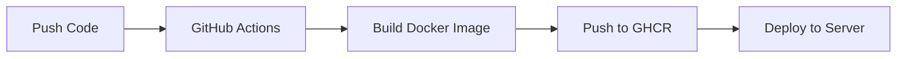

# 🚀 Deployment Guide

Hướng dẫn tổng hợp các phương thức deploy Strava Leaderboard application.

## Lựa chọn Deployment

### 1. 🖥️ Local Development (Windows/Mac/Linux)

**Phù hợp cho**: Development, testing trên máy local

**Công cụ**: Docker Desktop

**Hướng dẫn**: [DOCKER-QUICKSTART.md](./DOCKER-QUICKSTART.md)

**Ưu điểm**:
- ✅ Setup nhanh với Docker
- ✅ Không cần cài MongoDB thủ công
- ✅ Hot reload cho development
- ✅ Easy cleanup

**Nhược điểm**:
- ❌ Không dùng cho production
- ❌ Chỉ truy cập từ localhost

---

### 2. 🐧 Ubuntu/Linux Server (GitHub Container Registry)

**Phù hợp cho**: Production deployment trên VPS/Cloud

**Công cụ**: Docker + GitHub Container Registry

**Hướng dẫn**: [UBUNTU-DEPLOY.md](./UBUNTU-DEPLOY.md)

**Ưu điểm**:
- ✅ Production-ready
- ✅ Auto-build với GitHub Actions
- ✅ Pull image trực tiếp từ GitHub
- ✅ Dễ dàng update
- ✅ Scalable

**Nhược điểm**:
- ❌ Cần VPS/Cloud server
- ❌ Cần domain cho HTTPS

**Quick Start**:
```bash
git clone https://github.com/YOUR_USERNAME/strava-leaderboard.git
cd strava-leaderboard
cp .env.prod.example .env
nano .env  # Điền config
chmod +x deploy-ubuntu.sh
./deploy-ubuntu.sh
```

---

### 3. 🏗️ Manual Build & Deploy

**Phù hợp cho**: Custom deployment, các platform khác

**Build local và push lên server**:

```bash
# Build image
docker build -t strava-leaderboard .

# Save image
docker save strava-leaderboard > strava-leaderboard.tar

# Copy to server
scp strava-leaderboard.tar user@server:/tmp/

# On server: Load image
docker load < /tmp/strava-leaderboard.tar

# Run
docker run -d \
  --name strava-app \
  -p 3000:3000 \
  --env-file .env \
  strava-leaderboard
```

---

### 4. 🌩️ Cloud Platforms

#### AWS ECS (Elastic Container Service)

1. Push image lên ECR (Elastic Container Registry)
2. Tạo ECS Task Definition
3. Deploy lên ECS Cluster

#### Google Cloud Run

```bash
# Build và push
gcloud builds submit --tag gcr.io/PROJECT_ID/strava-leaderboard

# Deploy
gcloud run deploy strava-leaderboard \
  --image gcr.io/PROJECT_ID/strava-leaderboard \
  --platform managed \
  --region asia-southeast1 \
  --allow-unauthenticated
```

#### DigitalOcean App Platform

1. Connect GitHub repository
2. App Platform tự động detect Dockerfile
3. Configure environment variables
4. Deploy

---

## So sánh Deployment Options

| Feature | Local Docker | Ubuntu Server | Cloud Platform |
|---------|-------------|---------------|----------------|
| **Cost** | Free | $5-20/month | $10-50/month |
| **Setup Time** | 5 minutes | 15 minutes | 10 minutes |
| **Scalability** | Low | Medium | High |
| **Auto-scaling** | ❌ | ❌ | ✅ |
| **HTTPS** | ❌ | Manual setup | Auto |
| **Monitoring** | Manual | Manual | Built-in |
| **Backup** | Manual | Manual | Auto |
| **Maintenance** | Low | Medium | Low |

---

## CI/CD Pipeline

Application sử dụng GitHub Actions để tự động build và deploy.

### Workflow



### Auto-deployment

1. **Push code** lên GitHub
2. **GitHub Actions** tự động build Docker image
3. **Image** được push lên GitHub Container Registry
4. **Server** pull image mới và restart

### Manual Update trên Server

```bash
cd ~/strava-leaderboard
docker compose -f docker-compose.prod.yml pull
docker compose -f docker-compose.prod.yml up -d
```

---

## Environment Variables

### Required Variables

```env
# Strava API (Bắt buộc)
STRAVA_CLIENT_ID=your_client_id
STRAVA_CLIENT_SECRET=your_client_secret
STRAVA_REDIRECT_URI=http://your-domain.com/auth/callback

# Security (Bắt buộc)
SESSION_SECRET=random_32_character_string

# Database (Tự động nếu dùng docker-compose)
MONGODB_URI=mongodb://mongodb:27017/strava-leaderboard
```

### Optional Variables

```env
# Node environment
NODE_ENV=production

# Server port
PORT=3000

# Log level
LOG_LEVEL=info
```

---

## Security Checklist

### Pre-deployment

- [ ] Thay đổi `SESSION_SECRET` thành chuỗi ngẫu nhiên
- [ ] Kiểm tra `.env` không bị commit lên Git
- [ ] Cấu hình firewall trên server
- [ ] Sử dụng HTTPS cho production
- [ ] Backup MongoDB định kỳ

### Post-deployment

- [ ] Test OAuth flow hoàn chỉnh
- [ ] Kiểm tra MongoDB connection
- [ ] Test Strava API sync
- [ ] Monitor logs cho errors
- [ ] Setup SSL certificate (Certbot)

---

## Monitoring & Maintenance

### Health Checks

```bash
# Check application status
curl http://localhost:3000/api/leaderboard/day

# Check Docker containers
docker compose ps

# Check logs
docker compose logs -f app
```

### Backup Strategy

**MongoDB Backup**:
```bash
# Create backup
docker exec strava-mongodb mongodump --out /backup

# Schedule daily backup
0 2 * * * /path/to/backup-script.sh
```

### Update Strategy

1. **Test updates locally first**
2. **Backup database before update**
3. **Pull new image**
4. **Restart containers**
5. **Verify application works**
6. **Monitor for issues**

---

## Troubleshooting

### Common Issues

**1. Cannot pull image from GitHub**
```bash
# Login to GitHub Container Registry
echo $GITHUB_TOKEN | docker login ghcr.io -u $GITHUB_USERNAME --password-stdin
```

**2. MongoDB connection failed**
```bash
# Check MongoDB logs
docker compose logs mongodb

# Restart MongoDB
docker compose restart mongodb
```

**3. Strava OAuth error**
- Kiểm tra `STRAVA_CLIENT_ID` và `STRAVA_CLIENT_SECRET`
- Verify `STRAVA_REDIRECT_URI` matches Strava app settings
- Ensure Authorization Callback Domain is set correctly

**4. Port already in use**
```bash
# Find process using port 3000
sudo lsof -i :3000

# Kill process or change port in .env
```

---

## Support & Resources

### Documentation
- [Docker Quickstart](./DOCKER-QUICKSTART.md)
- [Ubuntu Deployment](./UBUNTU-DEPLOY.md)
- [GitHub Actions Workflow](./.github/workflows/README.md)

### External Resources
- [Strava API Documentation](https://developers.strava.com/)
- [Docker Documentation](https://docs.docker.com/)
- [GitHub Container Registry](https://docs.github.com/en/packages)

### Getting Help

1. Check existing issues on GitHub
2. Review application logs
3. Consult documentation
4. Create new issue with:
   - Error message
   - Steps to reproduce
   - Environment details

---

**Happy Deploying!** 🎉
